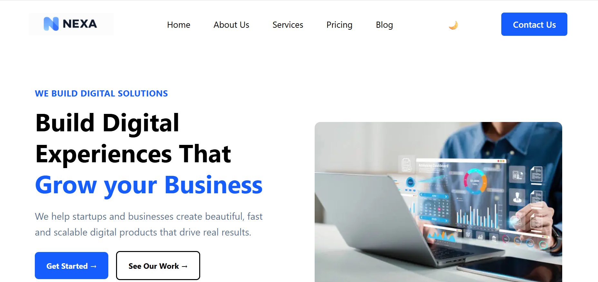

# 🚀 Nexa Digital Solution

A modern and responsive digital agency landing page built with **HTML5 and TailWind**. Nexa Digital Solution is designed to showcase digital services, client testimonials, company information, and a professional agency-style interface.

## 📸 Website Preview



## 🌐 About The Project

**Nexa Digital Solution** is a frontend website concept for a digital agency that helps startups and businesses build beautiful, fast, and scalable digital products.

The website provides a clean, modern, and professional user interface for presenting digital agency services and building trust with potential clients.

## ✨ Features

* 🏠 Modern Hero / Home Section
* 💼 Professional Services Section
* 🌐 Web Development
* 🎨 UI/UX Design
* 📱 Mobile Development
* 🔥 Digital Marketing
* ⭐ Client Testimonials
* 📩 Newsletter Subscription
* 🔗 Footer Navigation
* 📱 Responsive Navigation Menu
* 🎯 Call-to-Action Buttons
* 💻 Clean and Modern UI

## 🎯 Hero Section

The hero section introduces Nexa Digital Solution with:

* Professional agency introduction
* Main business heading
* Short description
* Call-to-action buttons
* Client trust information
* Customer review rating
* Hero image

## 💻 Services

The website presents four major digital services:

### 🌐 Web Development

We build fast, responsive, and scalable websites using modern web technologies.

### 🎨 UI/UX Design

Creating clean, attractive, and user-friendly digital experiences.

### 📱 Mobile Development

Building modern mobile applications designed for performance and usability.

### 🔥 Digital Marketing

Helping businesses improve their online presence and reach their target audience.

## ⭐ Testimonials

A dedicated testimonial section displays client reviews along with:

* Client profile
* Client name
* Professional information
* Customer rating
* Review description

## 🦶 Footer

The website footer includes:

* Company information
* Social media icons
* Quick links
* Services links
* Company links
* Newsletter subscription
* Privacy Policy
* Terms of Service

## 🛠️ Technologies Used

* **HTML5** — Website structure
* **CSS3** — Styling and layout
* **Responsive Design** — Adaptable layout for different screen sizes
* **Images & Icons** — Visual elements and branding

## 📁 Project Structure

```text
Nexa-Digital-Solution/
│
├── index.html
├── style.css
├── README.md
├── website-preview.png
│
├── logo.png
├── hamburgericon.png
├── web develop.png
├── fire icon.png
├── review img.png
│
├── facebok.avif
├── Twitter.png
├── instagram.png
├── tiktok-logo-png.png
│
├── avator-1.png
├── avator2.png
├── avator3.png
├── ui design.png
├── digital marketing.png
│
└── Hero-img.webp
```

> **Note:** Make sure all image files are available in the correct directory and their names match the paths used in `index.html`.

## 🚀 How to Run

No special installation or dependencies are required.

### 1. Clone the Repository

```bash
git clone https://github.com/your-username/nexa-digital-solution.git
```

### 2. Navigate to the Project

```bash
cd nexa-digital-solution
```

### 3. Open the Website

Open the `index.html` file in your browser.

You can also use **Live Server** in VS Code for a better development experience.

## 📱 Responsive Design

The website is designed to work across different screen sizes:

* 💻 Desktop
* 📱 Mobile
* 📟 Tablet

## 🎨 Website Sections

```text
┌─────────────────────┐
│       Header        │
└──────────┬──────────┘
           ↓
┌─────────────────────┐
│    Hero Section     │
└──────────┬──────────┘
           ↓
┌─────────────────────┐
│ Services / Features │
└──────────┬──────────┘
           ↓
┌─────────────────────┐
│    Testimonials     │
└──────────┬──────────┘
           ↓
┌─────────────────────┐
│       Footer        │
└─────────────────────┘
```

## 🔮 Future Improvements

Planned improvements for future versions:

* [ ] Complete responsive CSS optimization
* [ ] Add JavaScript interactions
* [ ] Add working Contact Us form
* [ ] Add functional Newsletter subscription
* [ ] Add About Us page
* [ ] Add Pricing section
* [ ] Add Blog section
* [ ] Add smooth animations and transitions
* [ ] Add dark mode
* [ ] Connect backend/API
* [ ] Add form validation
* [ ] Deploy the website online

## 📄 License

This project is created for **learning and portfolio purposes**.

You are free to modify, improve, and customize the project according to your requirements.

## 👨‍💻 Author

**Hamna Riaz**

If you like this project, consider giving the repository a ⭐ on GitHub!

---

## 💙 Nexa Digital Solution

> **Build Digital Experiences That Grow Your Business.**
