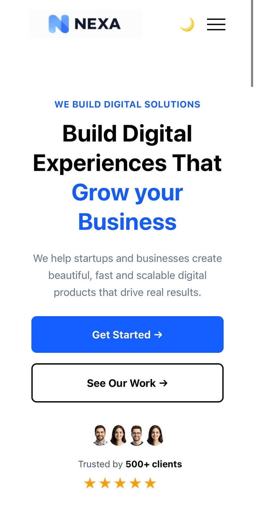

# 🚀 Nexa Digital Solution

A modern, responsive and professional **digital agency landing page** built with HTML5, CSS3, Tailwind CSS and JavaScript.

🌐 **Live Website:** https://nexa-digital-solutions-chi.vercel.app/

📂 **GitHub Repository:** https://github.com/hamnariaz208/Nexa-Digital-Solutions

--
## 📸 Website Screenshots

### Desktop View


### Mobile View

## 📌 About The Project

**Nexa Digital Solution** is a modern digital agency website designed to showcase professional digital services, client testimonials and company information through a clean and responsive interface.

This project was developed as part of the **Faran Digital Academy Web Engineering Internship — Week 4 Capstone Project**, focusing on frontend development, performance optimization, SEO, asset optimization and production deployment.

The website is optimized to provide a smooth experience across desktop, tablet and mobile devices.

---

## ✨ Features

* 🏠 Modern Hero Section
* 💼 Professional Services Section
* 🌐 Web Development Services
* 🎨 UI/UX Design Services
* 📱 Mobile Development Services
* 🔥 Digital Marketing Services
* ⭐ Client Testimonials
* 📩 Newsletter Section
* 🎯 Call-to-Action Buttons
* 📱 Responsive Navigation
* 💻 Fully Responsive Design
* ⚡ Optimized Web Assets
* 🔍 SEO Metadata
* 🌐 Open Graph Metadata
* 📌 Favicon
* 🖼️ Modern WebP Images
* 🔗 Social Media Links

---

## 🛠️ Technologies Used

* **HTML5** — Website structure
* **CSS3** — Styling and responsive layouts
* **Tailwind CSS** — Utility-first styling
* **JavaScript** — Interactivity and DOM manipulation
* **Git** — Version control
* **GitHub** — Source code management
* **Vercel** — Production deployment

---

## 🎯 Website Sections

### 🏠 Hero Section

The hero section introduces Nexa Digital Solution with:

* Professional agency introduction
* Main heading
* Supporting description
* Call-to-action buttons
* Client trust information
* Customer rating
* Hero imagery

### 💼 Services

The website presents four major digital services:

**🌐 Web Development**
Fast, responsive and scalable websites built using modern web technologies.

**🎨 UI/UX Design**
Clean and user-friendly digital experiences focused on usability and visual design.

**📱 Mobile Development**
Modern mobile solutions designed for performance and usability.

**🔥 Digital Marketing**
Digital strategies designed to improve business visibility and online presence.

### ⭐ Testimonials

The testimonial section showcases:

* Client profiles
* Client names
* Professional information
* Customer ratings
* Review descriptions

### 🦶 Footer

The footer contains:

* Company information
* Social media links
* Quick navigation
* Services links
* Company links
* Newsletter section
* Privacy Policy
* Terms of Service

---

## 📱 Responsive Design

The website is designed to work across different screen sizes:

* 💻 Desktop
* 📱 Mobile
* 📟 Tablet

The responsive layout ensures a consistent and user-friendly experience across devices.

---

## 🔍 SEO & Open Graph

The website includes important SEO and social sharing metadata:

* Descriptive page title
* Meta description
* Meta keywords
* Author information
* Favicon
* Open Graph title
* Open Graph description
* Open Graph image
* Open Graph website type

These features help improve search engine visibility and social media link previews.

---

## ⚡ Performance Optimization

The project includes production-focused optimization such as:

* 🖼️ Images converted to modern WebP format
* 📦 `node_modules/` excluded using `.gitignore`
* 🧹 Unnecessary project files cleaned
* 📱 Responsive layout optimization
* ⚡ Frontend assets optimized
* 🔗 Asset paths checked
* 🚀 Production deployment through Vercel

---

## 📁 Project Structure

```text
Nexa-Digital-Solutions/
│
├── index.html
├── script.js
├── package.json
├── package-lock.json
├── .gitignore
├── favicon.png
├── website.png
│
├── src/
│   ├── input.css
│   └── output.css
│
├── *.webp
├── *.png
│
└── README.md
```

---

## 🚀 Getting Started

### 1. Clone the Repository

```bash
git clone https://github.com/hamnariaz208/Nexa-Digital-Solutions.git
```

### 2. Navigate to the Project

```bash
cd Nexa-Digital-Solutions
```

### 3. Install Dependencies

```bash
npm install
```

### 4. Run the Project

```bash
npm run dev
```

You can also use **VS Code Live Server** for local development if required.

---

## 🌐 Live Deployment

The website is deployed on **Vercel** and connected with the GitHub repository.

### 🔗 Live Website

https://nexa-digital-solutions-chi.vercel.app/

Every new change pushed to the `main` branch can be deployed through the connected Vercel workflow.

---

## 👩‍💻 Author

**Hamna Riaz**

BS Computer Science Student | Frontend Web Developer

---

## 📄 License

This project was created for **learning, internship and portfolio purposes**.

---

<div align="center">

### 💙 Nexa Digital Solution

**Build Digital Experiences That Grow Your Business.**

⭐ If you like this project, consider giving the repository a star!
